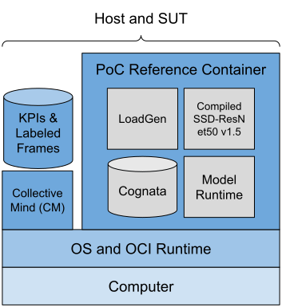

# About the POC 

[MLCommons](https://mlcommons.org/) and [AVCC](https://avcc.org/) have jointly defined and developed the MLPerf: Inference Automotive POC which the first release and subset of the MLPerf: Inference Automotive benchmark suite. The benchmark suite has been made possbile with MLCommons expertise in AI benchmarks and AVCC's expertise in automotive. Note that as this is a POC, not the full benchmark suite, there will be no official MLCommons submissions. Find the POC reference block diagram below.

For ease of use, many of the benchmark components are packaged in a container which, e.g., reduces the software requirements on the computer running the benchmark. Please note that the POC reference is **not for performance** purposes; it is a reference to enable anyone to familiarize themselves with the benchmark and to give an understanding of how it works. For performant versions of the POC each HW/SW vendor will have their own optimized version of the model for their target hardware.

To try out the POC reference yourself, please visit the [Run](/run/index.md) section. The POC reference only has 20 frames, to see the object detection model run on an entire sequence, follow this link:

* TODO: Add MLCommons YouTube clip

In the sections below the components of the benchmark are described.

## Collective Mind

Collective Mind (CM) is the automation and reproducibility framework/test harness. This framework is non-differentiating and sharing this amongst companies frees up time and resources which are better spent on optimizing models for the taget hardware. CM also makes collaboration easier as it's available open-source. Find more information about CM here:

* [https://github.com/mlcommons/ck/tree/master/cm](https://github.com/mlcommons/ck/tree/master/cm)

## SSD-ResNet50

SSD-ResNet50 v1.5 is a well-known object detection model which is one of the reasons it was selected the POC. It was agreed upon that the model is a representative model. Find more information about the models here:

* [SSD: Single Shot MultiBox Detector](https://arxiv.org/abs/1512.02325)
* [Deep Residual Learning for Image Recognition](https://arxiv.org/abs/1512.03385)
* [SSD PyTorch](https://github.com/uvipen/SSD-pytorch/tree/main)

## Cognata Dataset

The SSD-ResNet50 model was trained on a synthetic dataset from Cognata. Only camera data from three frontfacing cameras was used for the POC and the resolution is 8 MP. Find the subset of the dataset for the POC here:

* [Cognata Dataset for POC](https://drive.google.com/drive/folders/1FS-qLbzB5htgMnfry6z4gx8J_ZH_7MsJ?usp=drive_link)

To gain access to the full dataset, an MLCommons membership is required, find more details here:

* [MLCommons Cognata Dataset](https://mlcommons.org/datasets/cognata/)

## Additional Resources
### AVCC's Technical Reports (TRs)
Find the TRs from AVCC on AI benchmarking recommendations for automotive here:

* [TR-003 Conditions and Reporting](https://avcc.org/tr003/)
* [TR-004 Models and Datasets](https://avcc.org/tr004/)
* [TR-007 Compute Scenarios](https://avcc.org/tr007/)

### Join the MLPerf Automotive Working Group
Take part of the joint MLCommons and AVCC working group to shape the full automotive ML benchmark suite:

* [MLPerf Automotive Working Group](https://mlcommons.org/working-groups/benchmarks/automotive/)
